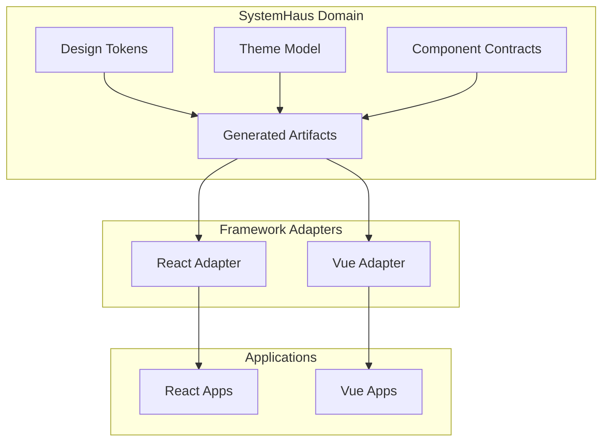
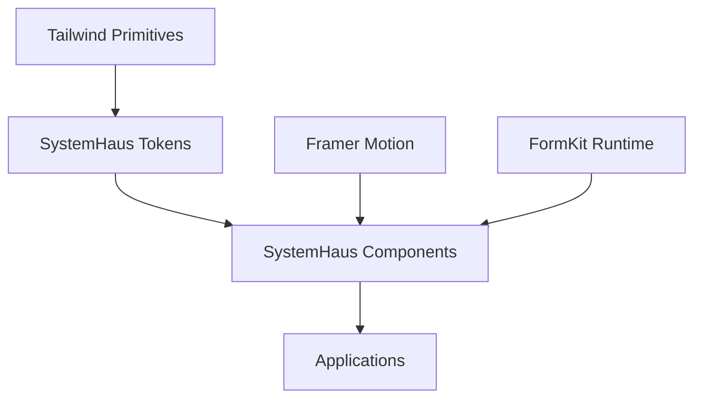

# Kurocado Studio — SystemHaus

SystemHaus is a multi-framework design system architecture built around a shared domain.

Instead of defining the design system inside a specific UI framework, SystemHaus models the design
language as a domain that produces artifacts consumed by framework adapters such as React and Vue.

This approach allows a single design system to power multiple frontend stacks while keeping tokens,
themes, and component contracts centralized.

The repository is organized as a pnpm + Turborepo monorepo so applications, domain libraries, and
framework adapters can evolve together while sharing tooling and infrastructure.

## System Architecture

SystemHaus separates the design system into two responsibilities.

The **domain layer** defines the design language.

Framework **adapters render that domain** using framework-specific primitives.



Applications consume framework adapters while the design language remains centralized in the domain.

## Runtime Foundations

SystemHaus is intentionally built on a small set of runtime constraints that simplify integration
and ensure consistent behavior across frameworks.

**Tailwind**

Tailwind provides the primitive value inventory for spacing, typography, radii, and base color
scales.

**Framer Motion**

All components are built on a polymorphic motion layer so animation and interaction patterns can be
composed directly into the component API.

**FormKit**

Accessible form controls map to the FormKit runtime, allowing form behavior, validation, and
accessibility rules to remain framework-agnostic.



## Package Manager and Tooling

The workspace uses pnpm and Turborepo to coordinate builds and development workflows.

pnpm workspaces are defined in `pnpm-workspace.yaml`.

Turborepo pipelines are defined in `turbo.json`.

Shared linting, formatting, and TypeScript configuration lives inside the `configs/` directory.

## Getting Started

Install dependencies and build the workspace.

```sh
pnpm install
pnpm build
```

Run Storybook hosts to explore components and adapters.

```sh
pnpm dev
```

Common development commands.

```sh
pnpm lint
pnpm test
pnpm build
```

## Environment

Each application or package documents its required variables locally.

## Template Usage

This repository can be used as a starting point for new design system implementations.

Before using it as a template:

Update the project name and description in `README.md` and the root `package.json`.

Remove or rename unused apps or packages.

Confirm Storybook hosts match the frameworks you want to support.
